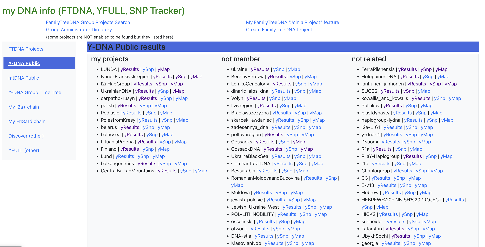
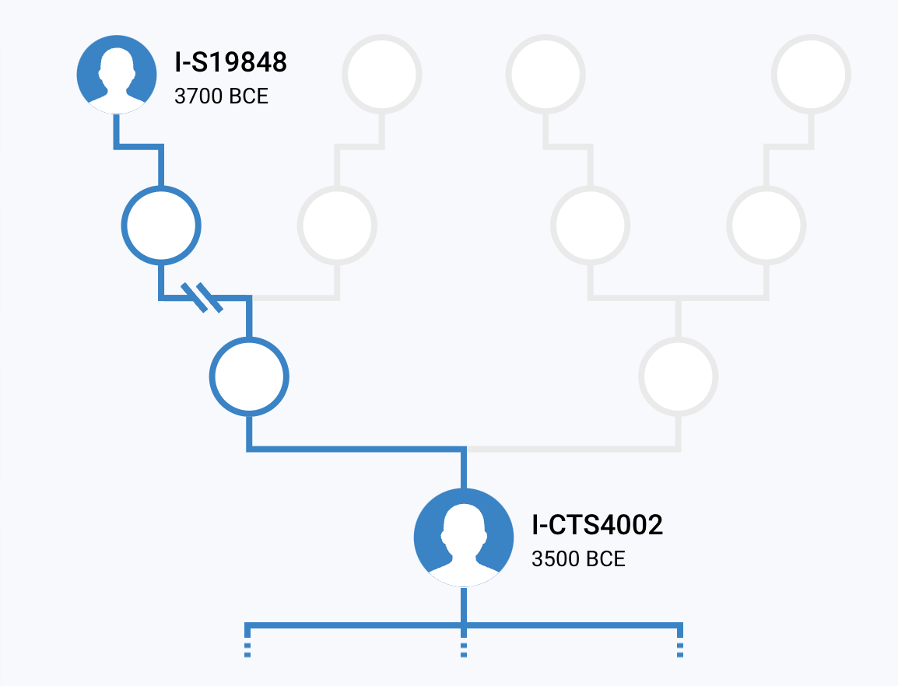
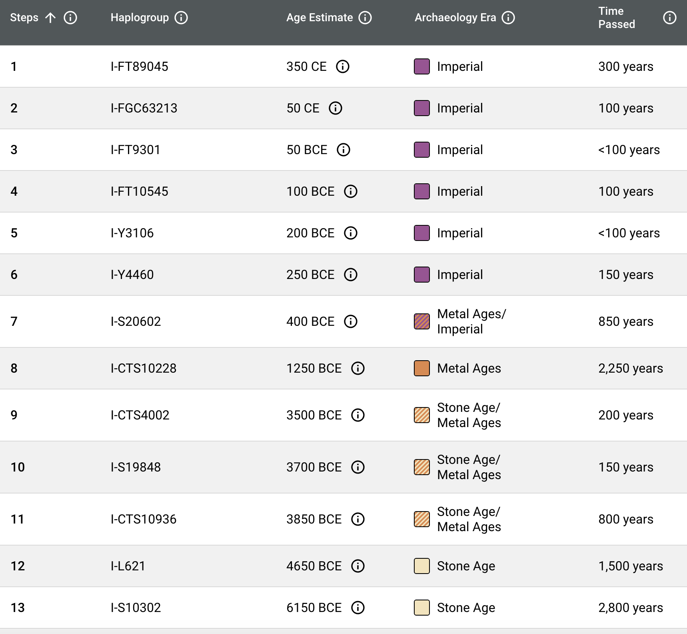
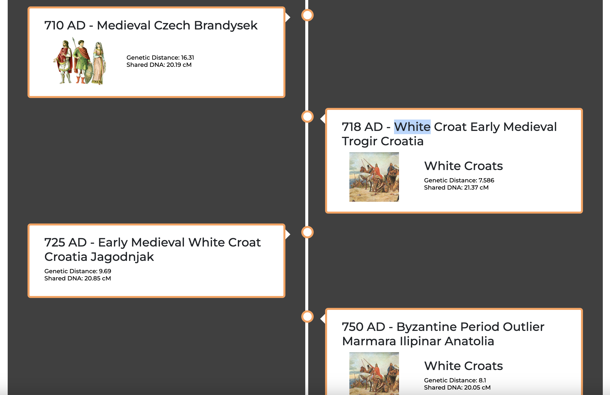

# My DNA app

A place to aggregate Y-DNA and mt-DNA info from different services.

I use
- [FamilyTreeDNA](https://www.familytreedna.com/)
- [SNP Tracker](https://scaledinnovation.com/gg/snpTracker.html)
- [YFULL](https://www.yfull.com/)
- [YSeq](https://www.yseq.net/)
- [TheYTree](https://www.theytree.com/)
- [DnaChron](https://www.dnachron.com/)

## Idea 1 - DONE

To have at least list of FTDNA groups which I frequently check, so to have one place to navigate from. MAYBE integrated with FTDNA API.

## Idea 2 - TODO

To represent Y-DNA Discover tree based on SNP, and every joint as hyperlink to to the SNP-based page.

## Idea 3 (or 2.2) - TODO

A list of SNPs with historical info, from no to Y-Adam. Similar way I described in my [article](https://lundiak.wordpress.com/2023/08/07/from-ydna-adam-to-andrii-haplogroup-i2a-globetrekker/)

Table just an example:

| SNP      | Age | History notes, Sources |
| -------- | --- | ---------------------- |
| Y4460    | 30  | note 1, source 1       |
| CTS10228 | 25  | note 2, source 2       |
| P37      | 40  | note 3, source 3       |

But most probably it can be simple list, UI-formatted nice and when scrolling all info is shown. Maybe some animation, not sure.

Inspired by FTDNA table actually:

which I would simply extend with Historical data, so I could easily find myself in space and time when I think about SNP or age of Y-DNA men with such SNP in they Y chromosome.

Something also similar to [MyTrueAncestry](https://mytrueancestry.com/) Full Detailed Timeline

Left side could be SNP + age info and right side could be History notes, ancient tribes, ethnicities, nationalities, etc.

Maybe use Bootstrap Accordion => https://getbootstrap.com/docs/5.3/components/accordion/
or https://getbootstrap.com/docs/5.3/components/card/

## Idea 4 - STR compare

In my Y-DNA research I frequently have a need to compare STR results for some or many men samples from FamilyTreeDNA [Y-DNA public page](https://www.familytreedna.com/public/I2aHapGroup?iframe=ydna-results-overview) where results are exposed in `TSV` format.

So, after `cd STR_compare` I run `npm start` and it compares `*.tsv` file I created in `data` folder, giving me result like this:

Script does NOT need the STR names as it shown on page table header. Script simply compares values positionally (from left to right).
- First value → first marker (`DYS393`)
- Second value → second marker (`DYS390`)
- and so on

## Idea 5 - my Matches

But it contradicts then with [My Genealogy](https://github.com/alundiak/my-genealogy) purpose and in general [gen-end-gen](https://github.com/alundiak/gen-and-gen) project purpose.

## Tech stack

- Used [React + TS SWC Vite setup ](https://vitejs.dev/guide/#scaffolding-your-first-vite-project)
- Used [Reactstrap](https://reactstrap.github.io) + [Bootstrap](https://getbootstrap.com)
- [Bootstrap Scrollspy](https://getbootstrap.com/docs/4.0/components/scrollspy/) at first but ended up changing to [IntersectionObserver](https://developer.mozilla.org/en-US/docs/Web/API/Intersection_Observer_API)
- CSS
  - I used [CSS React Hooks](https://css-hooks.com/docs/react/configuration) at first. After attempt to [migrate from v2 to v3](https://css-hooks.com/docs/migration/v3/), I realized CSS hooks became too complicated for my brain.
  - I could use [Styled Components](https://github.com/styled-components/styled-components) because it looks most reasonable solution, for complex projects.
  - Because of [CSS Nesting](https://caniuse.com/css-nesting) support since Dec-2023 I decided to use basic, native CSS, and relying on `import "./MyFile.css"` is very much enough for me.
- Deployment via GitHub Pages (with Vite config).
