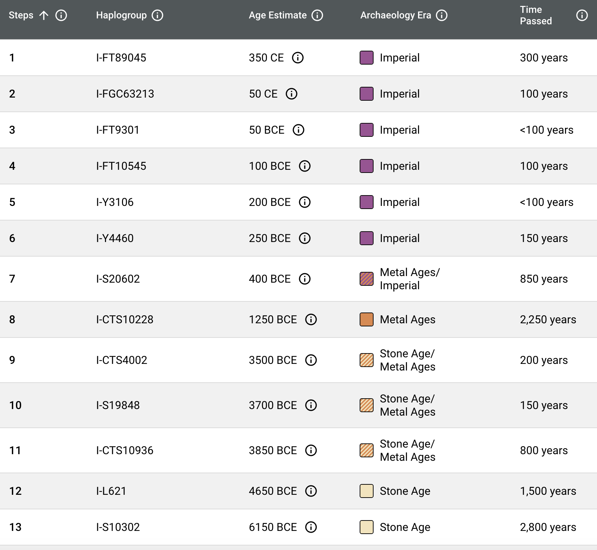
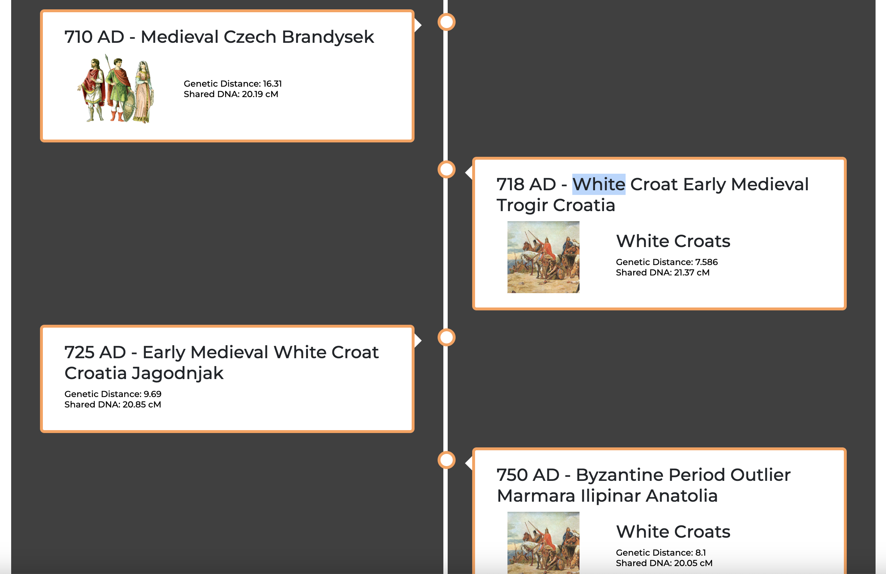

Y-DNA app
===

## Idea 1 - DONE

To have at least list of FTDNA groups which I frequently check, so to have one place to navigate from. MAYBE integrated with FTDNA API.

## Idea 2 - TODO

To represent Y-DNA Discover tree based on SNP, and every joint as hyperlink to to the SNP-based page.


## Idea 3 (or 2.2) - TODO

A list of SNPs with historical info, from no to Y-Adam. Similar way I described in my [article](https://lundiak.wordpress.com/2023/08/07/from-ydna-adam-to-andrii-haplogroup-i2a-globetrekker/)

Table just an example:

| SNP     | Age | History notes, Sources      |
|----------|-----|-----------------|
| Y4460 | 30  | note 1, source 1 |
| CTS10228 | 25  | note 2, source 2 |
| P37 | 40  | note 3, source 3 |

But most probably it can be simple list, UI-formatted nice and when scrolling all info is shown. Maybe some animation, not sure.

Inspired by FTDNA table actually:



which I would simply extend with Historical data, so I could easily find myself in space and time when I think about SNP or age of Y-DNA men with such SNP in they Y chromosome.

Something also similar to MyTrueAncestry Full Detailed Timeline



Left side could be SNP + age info and right side could be History notes, ancient tribes, ethnicities, nationalities, etc.

Maybe use Bootstrap Accordion => https://getbootstrap.com/docs/5.3/components/accordion/
or https://getbootstrap.com/docs/5.3/components/card/


## Tech stack

- Used React + TS SWC Vite setup https://vitejs.dev/guide/#scaffolding-your-first-vite-project
- Used CSS Nesting 2023-2024 supported https://caniuse.com/css-nesting
- Used CSS React Hooks https://css-hooks.com/docs/react/configuration
- Used [Reactstrap](https://reactstrap.github.io/?path=/docs/components-layout--layout)  + [Bootstrap](https://getbootstrap.com/docs/5.3/layout/grid/)
- Deployment via GitHub Pages (with Vite config).

## React + TypeScript + Vite

This template provides a minimal setup to get React working in Vite with HMR and some ESLint rules.

Currently, two official plugins are available:

- [@vitejs/plugin-react](https://github.com/vitejs/vite-plugin-react/blob/main/packages/plugin-react/README.md) uses [Babel](https://babeljs.io/) for Fast Refresh
- [@vitejs/plugin-react-swc](https://github.com/vitejs/vite-plugin-react-swc) uses [SWC](https://swc.rs/) for Fast Refresh

## Expanding the ESLint configuration

If you are developing a production application, we recommend updating the configuration to enable type aware lint rules:

- Configure the top-level `parserOptions` property like this:

```js
export default {
  // other rules...
  parserOptions: {
    ecmaVersion: 'latest',
    sourceType: 'module',
    project: ['./tsconfig.json', './tsconfig.node.json'],
    tsconfigRootDir: __dirname,
  },
}
```

- Replace `plugin:@typescript-eslint/recommended` to `plugin:@typescript-eslint/recommended-type-checked` or `plugin:@typescript-eslint/strict-type-checked`
- Optionally add `plugin:@typescript-eslint/stylistic-type-checked`
- Install [eslint-plugin-react](https://github.com/jsx-eslint/eslint-plugin-react) and add `plugin:react/recommended` & `plugin:react/jsx-runtime` to the `extends` list
