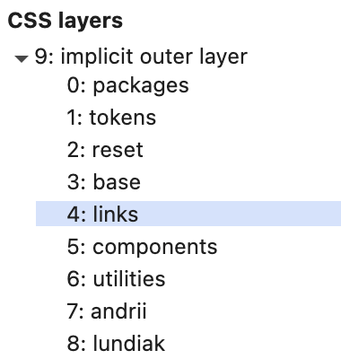

# Technical Notes

# 2026

- [Reactstrap](https://github.com/reactstrap/reactstrap) seems to be stuck on v9.2.3 which depends on Bootstrap v5.x.
  - And I see NO NEW version to support latest `react` and `typescript` so maybe I will need to redesign.
- TypeScript v 7.0.0rc is [available](https://devblogs.microsoft.com/typescript/announcing-typescript-7-0-rc/).
  - `tsc` seems to be OK now. BUT dependant NodeJS package remain using TS v6, as result at least ESLINT has issues => `ERR_PACKAGE_PATH_NOT_EXPORTED`.
- Replaced `@vitejs/plugin-react-swc` by `@vitejs/plugin-react` because I actually don't use any SWC plugins. And seems that after latest `vite`, `vitest`, `typescript` react boilerplate seems to not rely on SWC. Not sure.
- Upgraded to TypeScript v6. But also trying [v7-beta](https://devblogs.microsoft.com/typescript/announcing-typescript-7-0-beta/)
- tsconfig remain same but seems to be that after v7 releases MANY field sin `tsconfig.json` can be removed.

# 2025

Decides to rework base `index.css` from Vite + React boilerplate into using CSS Layers aka `@layer`.

| Feature                     | Standard? | Notes                               |
| --------------------------- | --------- | ----------------------------------- |
| `@layer` syntax             | ✅ Yes    | Part of official CSS                |
| Named layers (`reset`, etc) | ❌ No     | Developer-defined, not standardized |
| Built-in browser layers     | ❌ No     | No predefined or automatic layers   |

| Layer name   | Standard in spec? | Common in practice? |
| ------------ | ----------------- | ------------------- |
| `reset`      | ❌ No             | ✅ Yes              |
| `tokens`     | ❌ No             | ✅ Yes              |
| `base`       | ❌ No             | ✅ Yes              |
| `components` | ❌ No             | ✅ Yes              |
| `utilities`  | ❌ No             | ✅ Yes              |
| `frameworks` | ❌ No             | ⚠️ Sometimes        |
| `packages`   | ❌ No             | ⚠️ Rare             |

Cascade Order (from lowest to highest priority):

- Browser styles
- Layered styles (via `@layer`)
- Unlayered styles (`@import` or direct CSS)
- Inline styles or JS-modified styles

# Initial Tech Stack

- Used [React + TS SWC Vite setup ](https://vitejs.dev/guide/#scaffolding-your-first-vite-project)
- Used [Reactstrap](https://reactstrap.github.io) + [Bootstrap](https://getbootstrap.com)
- [Bootstrap Scrollspy](https://getbootstrap.com/docs/4.0/components/scrollspy/) at first but ended up changing to [IntersectionObserver](https://developer.mozilla.org/en-US/docs/Web/API/Intersection_Observer_API)
- CSS
  - I used [CSS React Hooks](https://css-hooks.com/docs/react/configuration) at first. After attempt to [migrate from v2 to v3](https://css-hooks.com/docs/migration/v3/), I realized CSS hooks became too complicated for my brain.
  - I could use [Styled Components](https://github.com/styled-components/styled-components) because it looks most reasonable solution, for complex projects.
  - Because of [CSS Nesting](https://caniuse.com/css-nesting) support since Dec-2023 I decided to use basic, native CSS, and relying on `import "./MyFile.css"` is very much enough for me.
- Deployment via GitHub Pages (with Vite config).
- Maybe use https://ui.shadcn.com/ to create new components
